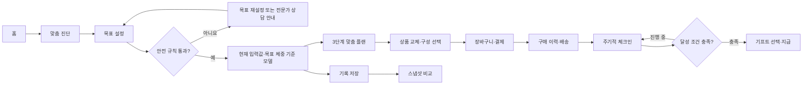
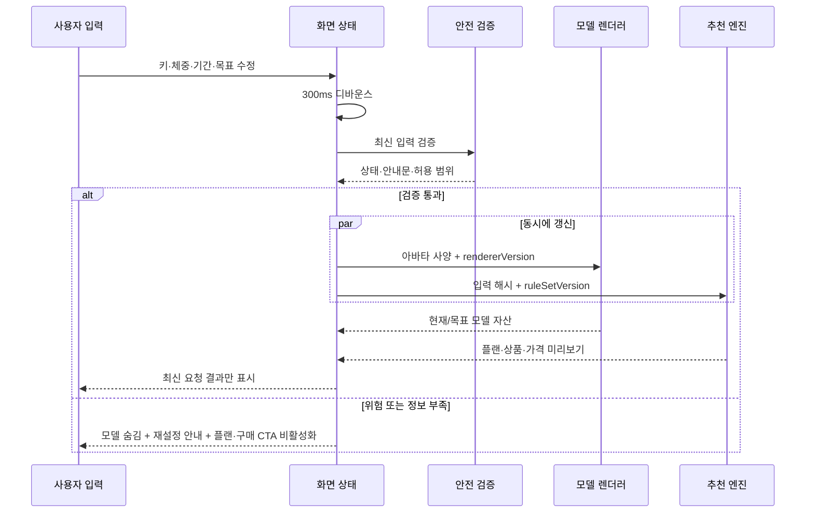
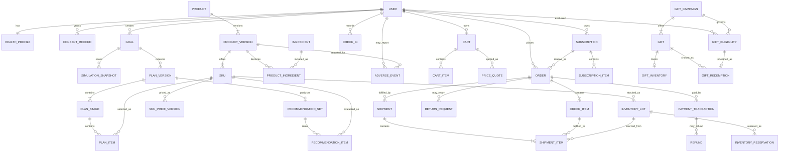

# FitPath 맞춤 다이어트 커머스 디자인 명세

> 문서 버전: 1.0  
> 작성일: 2026-08-29  
> 상태: MVP 설계안  
> 서비스명: **FitPath(핏패스)** — 가칭이며 상표·도메인 검토 전

---

## 1. 제품 정의

### 1.1 한 문장 소개

고객의 기본 신체 정보와 목표 기간·목표 체중을 바탕으로 예상 변화 모델, 기간별 운동·식단·보조식품 가이드를 만들고, 식단과 건강기능식품을 개인별 묶음으로 구매·기록·비교할 수 있는 웰니스 쇼핑몰이다.

### 1.2 고객 가치

- 무엇을 얼마나 오래 해야 하는지 한 화면에서 이해한다.
- 값을 수정할 때 예상 모델, 일정, 추천 플랜, 금액이 함께 갱신된다.
- 저장한 목표와 실제 체크인을 시간순으로 비교한다.
- 식단과 건강기능식품을 알레르기·선호·예산에 맞게 교체해 구매한다.
- 무리한 감량이 아니라 지속 가능한 습관과 목표 달성을 기프트로 보상받는다.

### 1.3 사업 가치

- 단품 판매보다 이해하기 쉬운 개인화 단계별 묶음을 제공한다.
- 플랜 선택, 주문, 구독, 재구매, 체크인을 하나의 고객 여정으로 연결한다.
- 어떤 규칙과 상품 버전으로 추천·구매가 이루어졌는지 보존해 상담과 운영에 활용한다.

### 1.4 제품 원칙

1. **건강 우선:** 판매보다 알레르기, 복약, 질환, 과도한 감량 목표 차단이 먼저다.
2. **예상은 예상답게:** 미래 모델은 동기 부여용 개념 시뮬레이션이며 실제 결과를 보장하지 않는다.
3. **고객이 결정:** 추천 이유, 가격, 배송 주기, 대체 상품을 공개하고 보조식품을 선택하지 않는 옵션을 둔다.
4. **기록은 불변:** 저장 스냅샷과 구매 당시 플랜·상품·가격은 나중에 원본이 바뀌어도 유지한다.
5. **습관을 보상:** 기프트는 체중 수치 하나가 아니라 체크인 지속성, 안전한 속도, 유지 행동을 함께 본다.
6. **몸을 평가하지 않음:** 체형을 성공/실패, 좋음/나쁨의 색이나 문구로 표현하지 않는다.

---

## 2. 범위와 전제

### 2.1 MVP 범위

- 대한민국의 만 19세 이상 성인 대상
- 이름, 남성/여성/선택하지 않음, 키, 현재 체중 입력
- 기간과 목표 체중 설정 및 안전성 검토
- 현재·목표 조건 기반의 얼굴 없는 비사실적 예상 아바타 생성
- 입력 수정 시 수치, 아바타, 추천, 가격의 실시간 갱신
- 저장 스냅샷 생성 및 두 시점 비교
- 적응기·진행기·유지기의 운동·식단·보조식품 3축 가이드
- 식단과 합법적으로 판매 가능한 식품·건강기능식품 판매
- 장바구니, 결제, 배송, 구독, 구매 이력
- 실제 체크인과 예상값 비교
- 목표 달성 조건 및 기프트 선택·지급
- 상품·추천 규칙·주문·기프트 운영용 관리자 화면

### 2.2 MVP에서 하지 않는 것

- 질병 진단, 치료, 처방 또는 의료 상담 대체
- 처방·일반의약품의 온라인 판매 또는 중개
- 키와 체중만으로 체지방률, 근육량, 특정 부위 변화 예측
- 실제와 구분하기 어려운 보장성 전후 사진 광고
- 미성년자, 임신·수유 중 사용자, 섭식장애 위험 사용자에게 자동 감량 플랜 제공
- 사용자 동의 없는 얼굴 사진 생성·보관·AI 학습
- 고객별로 다른 단품 가격을 적용하는 불투명한 가격 개인화

### 2.3 중요한 용어

| 용어 | 정의 |
|---|---|
| 현재 프로필 | 고객이 가장 최근에 수정한 이름·신체·선호 정보 |
| 목표 | 시작일, 종료일, 시작 체중, 목표 체중을 가진 버전형 객체 |
| 미리보기 | 저장 전 입력값으로 즉시 계산되는 임시 결과 |
| 스냅샷 | `기록 저장`을 누른 시점의 입력·결과·모델·플랜 버전을 묶은 불변 기록 |
| 체크인 | 실제 날짜의 체중, 습관, 컨디션, 메모 기록 |
| 플랜 버전 | 추천 규칙과 상품 구성이 고정된 구매 가능한 계획 |
| 예상 모델 | 목표 조건을 개념적으로 보여 주는 얼굴 없는 비사실적 아바타; 계정에 연결된 건강정보 파생 개인정보이며 실제 몸의 예측 사진이 아님 |

---

## 3. 핵심 사용자와 시나리오

### 3.1 주요 고객

| 고객 | 상황 | 필요한 경험 |
|---|---|---|
| 첫 다이어트 고객 | 무엇부터 할지 모르고 상품 비교가 어렵다 | 짧은 입력, 쉬운 단계 설명, 최소 구성 추천 |
| 바쁜 직장인 | 장보기·식단 준비 시간이 부족하다 | 정기 식단 배송, 짧은 운동, 일정 중심 안내 |
| 반복 도전자 | 이전 목표와 구매가 흩어져 있다 | 스냅샷 비교, 주문 재구매, 실패를 비난하지 않는 재설정 |
| 유지 고객 | 목표 체중 도달 뒤 요요가 걱정된다 | 유지기 플랜, 배송 빈도 축소, 습관형 기프트 |

### 3.2 대표 사용자 스토리

- 고객으로서 키·체중·기간·목표를 바꾸면 예상 모습과 플랜이 즉시 바뀌길 원한다.
- 고객으로서 현재 설정을 저장하고, 한 달 전 설정 또는 실제 결과와 비교하고 싶다.
- 고객으로서 왜 이 식단과 보조식품이 추천됐는지, 무엇 때문에 제외됐는지 알고 싶다.
- 고객으로서 플랜 전체가 아니라 단계별 또는 식단만 구매하고 싶다.
- 고객으로서 과거 주문 당시의 상품, 가격, 플랜을 그대로 확인하고 싶다.
- 운영자로서 품절, 알레르기, 성분 중복, 표시·광고 승인 상태를 추천 전에 차단하고 싶다.

---

## 4. 전체 사용자 여정



기본 흐름은 `홈 → 기본 정보 → 목표 → 시뮬레이션 → 플랜 → 상품 구성 → 결제 → 기록/체크인 → 기프트`다. 결과 화면에서는 언제든 입력값을 수정할 수 있다. 저장 전은 임시 상태이고 `기록 저장` 이후에만 날짜와 버전이 붙는 스냅샷이 된다.

---

## 5. 정보 구조와 내비게이션

### 5.1 데스크톱 전역 메뉴

- 로고
- 맞춤 플랜
- 스토어
- 내 기록
- 구매 내역
- 장바구니
- 프로필

로그인 후 헤더 아래에는 `전체 12주 중 4주`, `다음 체크인 D-2`, `다음 배송 9월 3일` 중 가장 중요한 두 항목만 보여 준다.

### 5.2 모바일 하단 탭

`홈 / 플랜 / 기록 / 스토어 / 마이`

장바구니는 상단 아이콘과 수량 배지로 제공한다. 결제·폼 화면에서는 하단 탭을 숨기고 뒤로 가기와 현재 단계만 노출한다.

### 5.3 URL 구조 예시

```text
/
/onboarding/profile
/onboarding/goal
/onboarding/lifestyle
/result
/plans/{planVersionId}
/store
/products/{productId}
/cart
/checkout
/dashboard
/records
/records/compare?left={id}&right={id}
/orders
/orders/{orderId}
/gifts
/account/privacy
/admin/*
```

---

## 6. 화면별 상세 설계

### 6.1 홈

**목표:** 서비스를 10초 안에 이해시키고 맞춤 진단을 시작하게 한다.

- 헤드라인: `내 몸과 일정에 맞춘 건강한 변화`
- 설명: `목표 기간을 정하면 운동·식단·보조식품 가이드와 예상 변화 모델을 한 번에 보여드려요.`
- 주요 CTA: `나의 플랜 만들기`
- 보조 CTA: `상품 먼저 보기`
- 3단계 소개: `정보 입력 → 예상 변화 확인 → 내 구성 선택`
- 신뢰 영역: 상품 분류, 원재료·알레르기 정보, 추천 기준 공개, 간편한 구독 해지
- 금지: 극단적 전후 사진, “무조건 감량”, “몇 주 만에 완성”, 의사처럼 보이는 AI 인물의 추천

### 6.2 맞춤 진단 — 기본 정보

스텝퍼: `1 기본 정보 / 2 목표 / 3 생활 습관 / 4 결과`

| 필드 | 형식 | 규칙 |
|---|---|---|
| 이름 | 텍스트 | 화면 인사에 쓰는 이름; 법적 실명 불필요 |
| 만 19세 이상 확인 | 필수 확인 | 성인 전용 서비스 진입 조건 |
| 연령대 | 19~29 / 30~39 / 40~49 / 50~59 / 60세 이상 | 정확한 생년월일 대신 안전 템플릿 선택에 필요한 최소 범주 수집 |
| 신체 계산 기준 | 남성 / 여성 / 선택하지 않음 | 왜 필요한지 설명; 선택하지 않으면 성별 비의존 보수적 템플릿 사용 |
| 키 | cm 숫자 | 단위 고정, 비현실 범위 입력 방지 |
| 현재 체중 | kg 숫자 | 소수점 1자리, 비현실 범위 입력 방지 |

UX 규칙:

- 한 화면에 질문 하나 또는 의미상 가까운 두 개만 배치한다.
- 숫자 입력은 모바일 숫자 키패드를 열고 슬라이더만 강요하지 않는다.
- 오류는 필드 바로 아래에 원인과 해결 방법을 함께 쓴다.
- 이전 단계로 이동해도 입력값을 유지한다.
- `건강 정보 처리 동의`와 `예상 모델 생성 동의`는 서비스 약관과 분리한다.

### 6.3 맞춤 진단 — 생활 습관과 안전 정보

개인화 품질과 안전을 위해 아래 항목을 추가한다. 선택 항목과 필수 안전 항목을 구분한다.

- 활동 수준과 주당 운동 가능 횟수
- 식단 유형, 피하고 싶은 음식, 알레르기
- 예산 범위, 조리 가능 시간, 배송 희망 주기
- 임신·수유 여부, 질환·복용약·특이체질 여부는 상세 병명 대신 우선 `해당/해당 없음/모름`으로 수집
- 해당 또는 모름이면 건강기능식품 자동 추천을 보류하고 전문가 상담 안내
- 섭식장애 진단 또는 위험 경험을 사용자가 표시하면 감량 수치·몸 이미지 중심 경험을 중단하고 지원 안내

건강 정보는 민감정보이므로 목적, 보관 기간, 철회 방법을 입력 전에 보여 준다. 마케팅 동의는 별도로 받고 기본 선택하지 않는다.

### 6.4 목표 설정

- 기간 프리셋: `1개월 / 3개월 / 6개월 / 12개월`
- 직접 입력: 1~12개월 또는 종료일
- 목표 체중: kg 숫자 입력
- 즉시 계산: 총 변화량, 예상 주수, 주당 평균 변화량, 체크인 횟수
- 요약: `현재 78.0kg → 목표 70.0kg · 24주`

표시용 계산식:

```text
현재 BMI = 현재 체중(kg) / 키(m)²
목표 BMI = 목표 체중(kg) / 키(m)²
목표 변화량 = 현재 체중 - 목표 체중
주당 목표 변화량 = 목표 변화량 / ((종료일 - 시작일) / 7)
```

계산 결과는 소수점 반올림 전 원본값으로 검증하고, 화면에는 이해에 필요한 자릿수만 표시한다.

#### 안전 검토 상태

| 상태 | UI | 동작 |
|---|---|---|
| 검토 가능 | 중립 안내 | 결과로 진행 |
| 빠른 목표 | 앰버 경고 | 기간 늘리기·목표 완화 제안, 보조식품 추천 보류 가능 |
| 감량 부적합 가능성 | 레드가 아닌 강한 중립 경고 | 자동 플랜 중단, 전문가 상담 안내 |
| 정보 부족 | 누락 필드 표시 | 진행 불가 |

기본 참고 기준은 점진적인 감량을 안내하는 공신력 있는 자료를 사용하되, 숫자 하나를 모든 사람에게 적용하지 않는다. 규칙 값은 의료·영양 전문가가 승인한 `SafetyRuleSet` 버전으로 관리한다. BMI는 참고 지표일 뿐 진단이나 개인의 건강 가치를 나타내지 않는다고 명시한다.

MVP 운영 가드레일 초안:

- 현재 또는 목표 BMI가 성인 저체중 참고 기준인 18.5 미만이면 자동 감량 플랜과 상품 묶음 CTA를 중단한다.
- 주당 목표 변화량이 점진적 감량 참고 상한인 약 0.9kg보다 빠르면 기간 연장을 먼저 제안하고 자동 보조식품 추천을 보류한다. 약 0.45kg보다 느린 목표는 위험으로 보지 않고 유지 가능한 목표로 허용한다.
- 이 기준은 진단이나 처방이 아니며 나이, 질환, 약물, 체성분, 의료진 판단을 대체하지 않는다.
- 수치와 차단 기준은 출시 전 국내 의료·영양 전문가 검수를 거쳐 변경 가능한 규칙으로 확정한다.
- 목표 체중이 현재 체중과 같으면 감량이 아닌 유지 플랜으로 전환하고 목표 모형을 과장해 변화시키지 않는다.
- 목표 체중이 현재 체중보다 높으면 체중 증가 목적임을 알리고, 감량 전용 MVP에서는 자동 플랜 대신 지원 범위를 안내한다.

### 6.5 결과 시뮬레이션 — 핵심 화면

데스크톱은 모델 비교와 편집 패널을 나란히 두고, 모바일은 모델 → 요약 → 편집 바텀시트 순으로 쌓는다.

```text
┌──────────────────────────────────────────────────────────────────┐
│ 목표 요약  현재 78.0kg → 목표 70.0kg · 6개월    [미저장 변경]   │
├──────────────────────────────────────────┬───────────────────────┤
│ 현재 입력값 모형  │  목표 체중 기준 모형  │ 빠른 수정             │
│      [아바타]      │       [아바타]       │ 키        [172 cm]    │
│                   [비교 슬라이더]         │ 현재 체중 [78.0 kg]   │
│  동일 포즈·배경·복장·스케일               │ 기간      [6개월]     │
│  예상 이미지이며 실제 결과와 다를 수 있음 │ 목표 체중 [70.0 kg]   │
│                                          │ [되돌리기] [적용됨]    │
├──────────────────────────────────────────┴───────────────────────┤
│ 변화 요약 · 주차별 체크포인트 · 안전 안내                        │
│ [기록 저장]                         [맞춤 플랜 보기]             │
└──────────────────────────────────────────────────────────────────┘
```

상호작용:

- `나란히 보기 / 드래그 비교` 토글
- 편집값 변경 후 300ms 디바운스로 계산과 모델을 갱신
- 요청 중에는 모델 영역만 스켈레톤 처리하고 입력은 유지
- 이전 요청보다 최신 요청만 반영하는 `last-write-wins` 적용
- `원래 값으로 되돌리기`, `기록 저장`, `플랜 선택` 제공
- 저장하지 않은 변경이 있으면 `미저장 변경` 배지와 이탈 확인 표시
- 이미지 생성 실패 시 수치 카드와 중립 실루엣으로 폴백

고정 문구:

> 이 이미지는 입력한 키·체중·목표를 단순화해 표현한 참고용 개념 모델입니다. 실제 체형, 체지방 분포, 건강 변화 및 결과와 다를 수 있습니다.

모델 주변에 특정 상품을 배치해 그 상품이 시각적 변화를 만들었다고 암시하지 않는다. 공유 기능은 MVP에서 제외하며, 추후 도입 시 기본값을 비공개로 하고 `AI 시뮬레이션·결과 보장 아님` 워터마크와 메타데이터 제거를 적용한다.

### 6.6 기록 저장과 비교

`기록 저장` 시 다음을 하나의 스냅샷으로 고정한다.

- 저장일과 사용자가 붙인 이름
- 키, 현재 체중, 기간, 목표 체중
- 생활 습관 중 추천에 사용한 항목
- 현재 입력값·목표 체중 기준 모델의 자산 키와 렌더러 버전
- 안전 규칙 버전, 추천 규칙 버전
- 선택한 플랜 버전과 당시 예상 금액
- 선택 메모

기록 화면:

- 카드 또는 타임라인으로 최신순 표시
- 최대 두 개를 선택해 `비교하기`
- 현재 체중, 목표 체중, 기간, 실제 체크인, 선택 플랜, 예상 모델을 표로 비교
- 차이는 `-2.3kg`처럼 숫자와 아이콘을 함께 써 색만으로 전달하지 않음
- 이름 변경, 데이터 내보내기, 삭제 제공
- 삭제는 확인 후 복구 유예 정책을 명확히 표시하고, 유예 종료 후 완전 삭제

예상값과 실제값은 차트에서 선 종류와 레이블을 다르게 한다. 실제값이 예상값과 다르더라도 실패 문구를 쓰지 않고 `계획 다시 맞추기`를 제안한다.

### 6.7 맞춤 플랜

선택한 전체 기간을 기본적으로 `적응기 20% / 진행기 60% / 유지기 20%`로 나눈다. 3주 이상의 기간에서 적응기와 유지기를 각각 `max(1주, floor(전체 주수 × 20%))`로 정하고, 남은 주수를 진행기에 배정해 세 단계 합계가 항상 전체 기간과 일치하게 한다. 전문가가 승인한 기간 템플릿이 있으면 템플릿이 우선한다.

각 단계에는 사용자가 요청한 세 가지 가이드 축을 항상 함께 보여 준다.

| 단계 | 운동 가이드 | 식단 가이드·판매 상품 | 보조식품 가이드·판매 상품 |
|---|---|---|---|
| 1. 적응기 | 걷기·가동성·기초 근력, 현재 수준에서 점진 시작 | 규칙적인 식사와 균형 구성을 돕는 스타터 식단 | 필수 아님. 안전 조건과 실제 필요가 확인된 경우에만 1개 후보군 |
| 2. 진행기 | 주간 일정에 맞춘 유산소·근력의 점진적 구성 | 단백질·채소·통곡 중심의 선택 가능한 정기 식단 | 허용 기능성과 라벨 범위 안에서 후보 제시, 중복 성분 차단 |
| 3. 유지기 | 즐길 수 있는 운동 조합과 회복·지속 계획 | 일반식 비중을 높이고 배송 빈도를 줄일 수 있는 유지 식단 | 계속 필요 여부를 다시 확인하고 중단 선택을 기본 제공 |

이 표는 화면 구조를 위한 예시이며 개인별 처방이 아니다. 운동 강도와 식단 템플릿은 연령, 활동 수준, 위험 플래그를 고려해 전문가 검수 콘텐츠에서 선택한다.

각 단계 카드에 표시할 정보:

- 시작일·종료일, 주차, 단계 목표
- 이번 주 운동 종류·횟수·대체 동작
- 식단 구성, 1회 분량, 영양 정보, 원재료, 알레르기
- 보조식품의 법적 상품 분류, 제조원·유통전문판매원, 원료·성분, 1일 섭취량, 주의사항
- 선택 근거와 제외 근거
- 배송 횟수, 정기 결제일, 단계 가격, 전체 예상 금액
- `이 상품 교체`, `이 단계만 구매`, `보조식품 없이 구성` 액션

### 6.8 맞춤 스토어

필터:

- 식단/건강기능식품
- 예산
- 식단 유형
- 알레르기·제외 원료
- 조리 방식과 보관 방법
- 배송 가능 지역·주기
- 단계와 기간

추천 카드:

- 상품명, 상품 분류, 제조사, 가격, 배송 정보
- `추천 이유`: `아침 조리 시간이 짧고, 선택한 알레르기 원료가 없으며, 1단계 예산에 맞아요.`
- `확인할 점`: 섭취 주의사항, 중복 성분, 복약 상담 필요 여부
- 추천 점수나 “당신과 97% 일치” 같은 근거 없는 정밀 수치는 사용하지 않는다.

묶음 옵션:

1. **Meal Only:** 식단 상품 + 무료 운동 가이드
2. **Meal + Optional Care:** 식단 + 사용자가 직접 선택한 건강기능식품 + 무료 운동 가이드
3. **Stage Pick:** 원하는 단계의 상품만 1회 또는 정기 구매

정기 구매는 미리 선택하지 않는다. 다음 결제일, 회차별 금액, 건너뛰기, 해지 방법을 CTA 근처에서 보여 준다.

### 6.9 상품 상세

#### 식단 상품

- 영양성분, 총 내용량, 1회 분량
- 전체 원재료와 알레르기 유발물질
- 제조·유통 정보, 소비기한 표시 방식
- 냉장·냉동·상온 보관과 배송 방식
- 조리 방법과 회수·환불 조건
- 플랜의 어느 단계·끼니에 포함되는지

#### 건강기능식품

- `건강기능식품` 여부와 관련 표시
- 제조원, 유통전문판매원, 품목 정보 확인 링크
- 인정된 기능성 내용 범위 안의 설명
- 기능성 원료·영양성분, 1일 섭취량과 섭취 방법
- 섭취 시 주의사항, 알레르기, 연령 제한
- 질환·특이체질·임신·수유·복약 시 전문가 상담 안내
- 이상사례 안내 및 고객센터 연결

제약회사가 제조·공급한 제품이라도 쇼핑몰에서는 법적으로 판매 가능한 식품·건강기능식품만 취급한다. `약`, `치료`, `처방`, `지방을 녹인다`처럼 의약품 또는 보장 효과로 오인될 표현을 사용하지 않는다.

### 6.10 장바구니와 결제

- 플랜 단계별로 상품을 그룹화
- 상품별 1회/정기, 수량, 첫 배송일, 이후 배송 주기
- 품절 대체 여부는 고객이 직접 승인
- 상품 금액, 배송비, 할인, 적립, 총액을 분리
- 구독 회차별 예상 금액과 해지·건너뛰기 정책 노출
- 수령인, 연락처, 우편번호, 기본 주소, 상세 주소, 배송 메모를 결제 단계에서 수집하고 주문 당시 `address_snapshot`으로 고정
- 결제 직전 알레르기·중복 성분·주의사항을 다시 검사
- 주문 완료 시 플랜과 상품의 당시 버전·가격을 주문에 복제 저장

### 6.11 내 대시보드와 체크인

대시보드 우선순위:

1. 오늘 할 일: 식사, 운동, 섭취 안내
2. 다음 체크인과 배송
3. 목표 진행 상황
4. 최근 기록과 구매

체크인 필드:

- 날짜와 실제 체중
- 운동 완료, 식단 실천, 수면·컨디션의 간단한 선택
- 메모
- 신체 사진은 선택 사항이며 MVP 기본값은 사용하지 않음

일일 체중에 과도한 의미를 부여하지 않고 주간 추세를 기본으로 보여 준다. 체크인에서 이상 증상이나 건강 우려를 선택하면 상품 추천을 멈추고 고객지원·전문가 상담 경로를 표시한다.

### 6.12 구매 이력

목록 및 상세에 다음을 보존한다.

- 주문번호, 결제일, 결제·환불 상태
- 구매 당시 플랜명과 버전
- 상품명, 옵션, 수량, 당시 가격
- 배송 주소의 마스킹 표시, 배송·구독 상태
- 결제 명세, 영수증, 재구매, 문의
- 반품·교환·구독 변경 이력

추천이 바뀌거나 상품이 단종돼도 과거 주문은 변경하지 않는다. `재구매` 시에는 현재 판매 가능성과 안전 규칙을 다시 검사하고 변경점을 고객에게 보여 준다.

### 6.13 성공 기프트

기프트는 시작 전에 규칙과 가치를 공개한다.

성공은 두 경로로 정의해 목표 체중 하나만 보상하지 않는다.

1. **목표 경로:** 안전하게 승인된 목표 범위와 유지 확인을 달성
2. **습관 경로:** 목표 수치와 무관하게 체크인·운동·식사·유지기 조건을 달성

기본 달성 조건 예시:

- 목표 종료일 도달
- 계획 기간 중 필수 체크인의 일정 비율 완료
- 목표 체중 또는 전문가 검수된 목표 범위 도달
- 안전 규칙을 벗어난 급격한 감량 기록이 없음
- 유지 확인 체크인 또는 건강 습관 미션 완료

건강기능식품 샘플은 별도 안전 검사 없이 기프트로 자동 지급하지 않는다.

기프트 운영 가드레일:

- 랜덤 추첨형 경품을 사용하지 않고 혜택과 달성 조건을 사전에 고정·공개한다.
- 구매 금액·구매량·보조식품 구매 여부·빠른 감량 속도에 따라 기프트 가치를 높이지 않는다.
- 혜택 가치 상한, 캠페인 문구, 대상 상품 결합 방식을 법무가 승인한 뒤 게시한다.
- 건강기능식품 자체를 자동 기프트로 제공하지 않는다.

고가 기프트가 아니라면 자기 기록 기반으로 운영해 사진 제출을 요구하지 않는다. 고가 기프트에 검증이 필요하면 별도 동의한 스마트 체중계 또는 제휴 측정 방식만 사용하고 대안을 제공한다.

MVP에서는 식단 크레딧·무료 배송처럼 자동 발급 가능한 디지털 기프트만 제공한다. 여러 실물 기프트 중 선택하고 재고·배송을 관리하는 카탈로그는 P1에서 확장한다.

달성 화면:

- 비체형 중심 축하 애니메이션
- `기프트까지 남은 조건` 체크리스트
- 기프트 카탈로그: 식단 크레딧, 무료 배송, 웰니스 굿즈 등
- 1개 선택 후 쿠폰/배송 상태 확인
- 기프트 규칙 버전, 판정일, 지급·취소 이력 보존

목표를 더 낮춰 기프트를 반복 획득하도록 유도하지 않는다. 다음 프로그램은 유지·운동 습관 목표를 우선 제안한다.

### 6.14 관리자 화면

- 고객 조회: 최소 권한, 민감정보 마스킹, 접근 감사 로그
- 상품 관리: 분류, 제조사, 원료, 알레르기, 기능성 문구, 주의사항, 품절, 로트·소비기한
- 성분 규칙: 중복, 상호 주의, 대상 제한, 전문가 상담 조건
- 플랜 템플릿: 기간별 단계와 운동·식단 콘텐츠 버전
- 추천 규칙: 배포 전 승인, 롤백, 영향 범위 확인
- 광고 문구 승인: `review_id`, 허용 근거, 승인 문안 버전, 매체 범위, 상태, 승인자, 만료일. 승인 상태가 아니면 상품 상세·추천·배너·푸시 게시 차단
- 주문·정기배송·환불·이상사례 접수
- 기프트 규칙·재고·지급 검토
- 추천 결과와 제외 사유 재현

---

## 7. 예상 이미지 모델 설계

### 7.1 권장 방식

MVP는 사진 생성형 AI보다 **파라미터 기반의 얼굴 없는 비사실적 3D 또는 일러스트 아바타**를 우선한다. 키와 체중만으로 개인의 실제 지방 분포나 얼굴 변화를 알 수 없으므로, 사진처럼 사실적인 결과보다 한계가 분명하고 반복 생성이 일관된 모델이 적합하다. 계정·목표와 연결된 아바타는 익명정보가 아니며 건강정보 파생 개인정보와 같은 수준으로 보호한다.

### 7.2 입력과 출력

입력:

- 키, 현재 체중, 목표 체중
- 신체 계산 기준 선택값
- 기간은 아바타 모양이 아니라 레이블과 타임라인에만 사용
- 선택 가능한 중립적 체형 프레임·피부색·복장; 추천 결과에는 영향 없음

출력:

- 현재 조건 아바타
- 목표 조건 개념 아바타
- 동일 포즈, 카메라, 조명, 복장, 배경, 스케일
- `예상/참고용` 워터마크와 생성 기준 버전

표현하지 않는 것:

- 예상 체지방률, 근육량, 허리둘레 등 측정하지 않은 수치
- 얼굴의 나이 변화, 피부 개선, 자세 교정
- 성적 대상화, 과도하게 마른 체형, 특정 신체 부위 강조
- “건강한 몸”을 한 가지 체형으로 단정하는 색·배지

### 7.3 업데이트 흐름



### 7.4 저장 정책

- 미리보기 자산은 짧은 TTL 캐시로 관리한다.
- 저장 시에만 고지한 보유기간 또는 사용자 삭제 시까지 지속 저장되는 `SimulationSnapshot`을 생성한다.
- 자산 URL은 공개 URL이 아니라 만료되는 서명 URL을 사용한다.
- 렌더러 버전이 바뀌어도 과거 이미지는 그대로 보존한다.
- 사용자가 스냅샷을 삭제하면 법적 보존 필요가 없는 모델 자산도 연결 삭제한다.

### 7.5 V2 사진 기반 기능 조건

실제 사진 기반 변환은 별도 명시 동의, 원본 삭제 기간, 얼굴 생체정보 비사용, AI 학습 제외, 결과 워터마크, 즉시 삭제 기능을 갖춘 뒤 별도 법률·윤리 검토를 통과한 경우에만 도입한다. 사진 제출을 구매나 기프트의 필수 조건으로 만들지 않는다.

---

## 8. 개인화 및 추천 규칙

### 8.1 추천 파이프라인

```text
입력 정규화
  → 안전성·성인 여부·목표 검증
  → 알레르기·복약/질환 플래그·연령·성분 중복 하드 제외
  → 배송 가능·재고·판매 승인 상태 제외
  → 식단 선호·조리 시간·예산·활동 일정 적합도 순위화
  → 세 단계 플랜 구성
  → 추천 이유와 제외 이유 생성
  → 규칙/상품/가격 버전 고정
```

하드 제외는 판매 점수보다 항상 우선한다. 고객이 UI에서 하드 제외를 해제할 수 없고, 필요한 경우 전문가 검토 후 별도 승인 경로를 둔다.

### 8.2 입력 우선순위

1. 안전: 알레르기, 임신·수유, 복약·질환 플래그, 이상사례
2. 법적 판매 가능성: 상품 승인 상태, 허용 문구, 연령 조건
3. 실행 가능성: 예산, 배송 지역, 조리 시간, 운동 가능 횟수
4. 선호: 식단 유형, 맛, 형태
5. 운영: 재고, 배송 회차

### 8.3 설명 가능한 추천

각 추천은 최대 세 가지 쉬운 이유를 제공한다.

```text
추천 이유
• 주 5일 간편식을 원한 일정에 맞아요.
• 표시한 우유 알레르기 원료를 포함하지 않아요.
• 1단계 월 예산 안에 들어와요.

확인할 점
• 건강기능식품은 필수가 아니며 복용약이 있다면 먼저 전문가와 상담하세요.
```

안전 필터를 통과한 후보 안에서만 사용하는 순위화 예시는 다음과 같다.

| 평가 축 | 예시 비중 |
|---|---:|
| 영양·단계 적합도 | 30% |
| 식사 선호·알레르기 적합도 | 20% |
| 근거 수준과 주의사항 충족 | 20% |
| 예산·지속 가능성 | 15% |
| 배송·재고 적합도 | 10% |
| 메뉴 다양성 | 5% |

비중은 검증 후 버전으로 관리한다. 판매 마진은 비공개 추천 순위에 사용하지 않으며 광고·협찬 상품은 추천 결과와 분리해 명시한다.

### 8.4 수정과 구매 후 변경

- 구매 전 입력 수정: 미리보기와 새 추천 후보를 즉시 다시 계산
- 장바구니에 담은 뒤 수정: 기존 장바구니 상품을 자동 교체하지 않고, 안전 또는 구성 차이를 보여 준 뒤 고객이 명시적으로 변경을 승인
- 구매 후 프로필 수정: 이미 결제한 주문은 자동 변경하지 않음
- 정기 구매 중 수정: 다음 회차부터 적용할 변경안을 고객이 승인
- 모든 결정에 `ruleset_version`, `catalog_version`, `input_hash`, 제외 이유를 보존

---

## 9. 데이터 설계

### 9.1 핵심 관계



### 9.2 주요 객체

| 객체 | 핵심 필드 |
|---|---|
| `User` | id, email/로그인 식별자, display_name, locale, timezone, status |
| `HealthProfile` | user_id, adult_verified, age_band, sex_basis, height_cm, current_weight_kg, activity_level, diet_preferences, allergy_codes, risk_flags, updated_at |
| `ConsentRecord` | user_id, consent_type, policy_version, granted, granted_at, withdrawn_at |
| `Goal` | id, user_id, version, start_date, end_date, start_weight_kg, target_weight_kg, status, safety_status, safety_ruleset_version |
| `SimulationSnapshot` | id, goal_id, profile_payload_snapshot, current_asset_key, target_asset_key, renderer_version, safety_ruleset_version, recommendation_ruleset_version, optional_plan_version_id, optional_estimated_total_minor, disclaimer_version, note, created_at |
| `PlanVersion` | id, goal_id, recommendation_ruleset_version, input_hash, status, currency, estimated_total_minor, created_at |
| `PlanStage` | id, plan_version_id, stage_type, starts_at, ends_at, exercise_content_version |
| `Product` | id, stable_code, type, status, current_version_id |
| `ProductVersion` | id, product_id, version, legal_category, name, manufacturer, distributor, nutrition_payload, allowed_claims, cautions, approval_status, ad_review_id, approved_copy_version, media_scope, effective_at |
| `Ingredient` | id, normalized_name, allergen_code, unit_basis |
| `ProductIngredient` | product_version_id, ingredient_id, amount, unit, source_label |
| `IngredientSafetyRule` | id, ingredient_id, rule_version, target_condition, action, rationale, approved_by |
| `SKU` | id, product_version_id, option_code, option_snapshot, stock_status, shipping_type |
| `SKUPriceVersion` | id, sku_id, price_minor, tax_type, starts_at, ends_at |
| `InventoryLot` | id, sku_id, lot_number, quantity, expires_at, storage_condition, recall_status |
| `InventoryReservation` | id, inventory_lot_id, owner_type, owner_id, quantity, expires_at, consumed_at |
| `PlanItem` | stage_id, sku_id, product_version_id, quantity, cadence, reason_codes, exclusion_checks |
| `CheckIn` | id, user_id, goal_id, measured_at, weight_kg, habit_flags, condition, note, optional_asset_key |
| `AdverseEvent` | id, optional_user_id, product_version_id, order_item_id, first_known_at, severity, description, intake_status, report_due_at, reported_at, evidence_refs, status |
| `RecommendationSet` | id, plan_version_id, engine_version, ruleset_version, input_hash, created_at |
| `RecommendationItem` | id, set_id, sku_id, product_version_id, rank, score_breakdown, reason_codes, exclusion_rule_ids, customer_action |
| `Cart` | id, user_id, optional_plan_version_id, status, expires_at |
| `CartItem` | id, cart_id, sku_id, product_version_id, quantity, purchase_type, cadence |
| `PriceQuote` | id, cart_id, item_subtotal_minor, shipping_minor, discount_minor, tax_minor, total_minor, currency, expires_at |
| `Promotion` | id, code, benefit_rule_version, starts_at, ends_at, usage_limit |
| `Order` | id, user_id, order_number, optional_plan_version_id, optional_recommendation_set_id, optional_subscription_id, order_source, address_snapshot, amounts, payment_status, fulfillment_status, ordered_at |
| `OrderItem` | order_id, product_id, product_version_id, sku_id, optional_subscription_item_id, product_snapshot, option_snapshot, unit_price_minor, quantity, subscription_cycle |
| `PaymentTransaction` | id, order_id, provider, transaction_ref, type, amount_minor, status, processed_at |
| `Refund` | id, payment_transaction_id, order_item_id, amount_minor, reason, status, processed_at |
| `ReturnRequest` | id, order_id, order_item_id, type, reason, status, requested_at, completed_at |
| `OrderStatusHistory` | order_id, status_type, from_status, to_status, reason, changed_at |
| `Shipment` | id, order_id, carrier, tracking_number, cold_chain, status, shipped_at, delivered_at |
| `ShipmentItem` | shipment_id, order_item_id, inventory_lot_id, quantity |
| `Subscription` | id, user_id, payment_method_ref, status, starts_at, paused_until, cancel_requested_at, cancel_effective_at, next_charge_at |
| `SubscriptionItem` | id, subscription_id, sku_id, quantity, cadence, next_delivery_at, active_from, active_to |
| `GiftCampaign` | id, name, rule_version, starts_at, ends_at, per_user_limit, status |
| `Gift` | id, campaign_id, type, name, value_snapshot, fulfillment_method, status |
| `GiftInventory` | gift_id, available_quantity, reserved_quantity, updated_at |
| `GiftEligibility` | id, user_id, goal_id, campaign_id, gift_rule_version, progress, status, evaluated_at, reason_codes |
| `GiftRedemption` | id, eligibility_id, gift_id, benefit_snapshot, status, redeemed_at, fulfilled_at |
| `RewardEventLedger` | id, user_id, campaign_id, goal_id, event_type, reference_id, created_at |
| `AuditLog` | actor_id, action, object_type, object_id, reason, timestamp |

### 9.3 불변성과 버전 규칙

- 현재 프로필은 수정 가능하지만 `Goal`, `SimulationSnapshot`, `PlanVersion`, `OrderItem`의 과거 버전은 덮어쓰지 않는다.
- 주문에는 상품명·성분·주의사항·가격 등 구매 시점 표시 내용을 스냅샷으로 복제한다.
- 상품 수정은 새 버전을 만들고 진행 중 주문에 자동 반영하지 않는다.
- 안전·추천·기프트 규칙에는 버전과 승인자를 기록한다.
- 금액은 부동소수점이 아니라 최소 통화 단위 정수로 저장한다.
- 체중은 화면 표시 정밀도와 별도로 표준 단위의 고정 소수점으로 저장한다.
- 플랜을 거치지 않은 직접 구매를 위해 `Order.optional_plan_version_id`는 비울 수 있고 `order_source`로 플랜·직접 구매·재구매를 구분한다.
- 구독 갱신 회차마다 별도 `Order`를 생성해 당시 가격, 상품, 배송, 환불 이력을 보존한다.
- 어떤 로트가 어떤 주문 상품에 출고됐는지 `ShipmentItem`으로 연결해 소비기한·리콜 대상 고객을 추적한다.
- 재고는 만료되는 `InventoryReservation`으로 견적·결제 경쟁 상태를 막고 결제 성공 시에만 확정 차감한다.
- 기프트 중복 지급은 `(campaign_id, user_id, goal_id)` 유일 키와 `RewardEventLedger`로 차단한다.
- 건강정보 동의 철회 시 법정 주문 기록 때문에 `Goal`이나 `HealthProfile`이 함께 남지 않도록 주문의 상품·가격·고지 스냅샷과 건강정보 연결을 분리 또는 가명화한다.

---

## 10. 서비스 인터페이스 초안

| 동작 | 인터페이스 | 핵심 결과 |
|---|---|---|
| 프로필 임시 저장 | `PATCH /v1/profile` | 현재 프로필, 검증 상태 |
| 목표 검증 | `POST /v1/goals/validate` | 기간·속도 요약, 안전 상태, 안내 |
| 미리보기 생성 | `POST /v1/simulations/preview` | 모델 자산, 렌더러 버전, 만료 시각 |
| 기록 저장 | `POST /v1/snapshots` | 불변 스냅샷 ID |
| 기록 비교 | `GET /v1/snapshots/compare?left=&right=` | 필드별 차이와 자산 |
| 플랜 추천 | `POST /v1/recommendations` | 3단계 플랜, 이유, 제외 사유, 버전 |
| 상품 교체 | `POST /v1/plans/{id}/replace-item` | 새 플랜 버전과 가격 차이 |
| 상품 목록·상세 | `GET /v1/products`, `GET /v1/products/{id}` | 판매·표시 승인된 현재 상품 버전 |
| 장바구니 생성 | `POST /v1/carts` | 플랜 또는 직접 구매용 장바구니 |
| 장바구니 편집 | `POST/PATCH/DELETE /v1/carts/{id}/items` | 고객이 승인한 현재 구성 |
| 장바구니 검증 | `POST /v1/carts/{id}/validate` | 안전·재고·가격·배송 재검증 |
| 결제 견적 | `POST /v1/checkout/quotes` | 서버 계산 금액과 만료되는 `quote_id` |
| 주문 생성 | `POST /v1/orders` | 유효한 `quote_id` 소비, 주문 스냅샷 |
| 구매 이력 | `GET /v1/orders` | 페이지형 주문 목록 |
| 주문 상세 | `GET /v1/orders/{id}` | 상품 스냅샷, 결제·배송·환불 이력 |
| 취소·반품·교환 | `POST /v1/orders/{id}/cancel`, `POST /v1/returns` | 정책 검증과 상태 이력 |
| 구독 생성·조회 | `POST /v1/subscriptions`, `GET /v1/subscriptions/{id}` | 회차 구성과 다음 결제·배송 |
| 구독 변경 | `PATCH /v1/subscriptions/{id}` | 일시정지·건너뛰기·구성 변경·해지 효력일 |
| 체크인 | `POST /v1/check-ins` | 추세, 다음 체크인, 안전 상태 |
| 기프트 판정 | `GET /v1/goals/{id}/gift-eligibility` | 조건별 진행과 규칙 버전 |
| 기프트 카탈로그 | `GET /v1/gifts?eligibility_id=` | 선택 가능 혜택과 재고·유효기간 |
| 기프트 선택 | `POST /v1/gift-redemptions` | 지급/배송 상태 |
| 동의 조회·철회 | `GET/PATCH /v1/consents` | 목적별 현재 동의와 철회 시점 |
| 건강정보 삭제 | `POST /v1/privacy/deletion-requests` | 삭제 범위, 법정 분리 보관, 처리 상태 |
| 이상사례 접수 | `POST /v1/adverse-events` | 섭취 중단 안내와 운영 처리 티켓 |
| 결제 웹훅 | `POST /v1/webhooks/payments` | 서명 검증 후 결제 상태 반영 |
| 배송 웹훅 | `POST /v1/webhooks/shipments` | 검증 후 배송 이벤트 반영 |

요청에는 사용자 권한을 서버에서 다시 확인한다. 클라이언트가 보내는 가격, 안전 상태, 기프트 자격은 신뢰하지 않고 서버가 재계산한다. 주문은 서버가 만든 만료 전 `quote_id`만 소비하고, 안전·재고·가격 검사를 같은 처리 경계에서 다시 수행한다. 결제·환불·재고·구독·기프트를 바꾸는 요청은 `Idempotency-Key`를 요구한다. 결제·배송 웹훅은 서명을 검증하고 중복 호출에도 한 번만 반영한다.

---

## 11. 디자인 시스템

### 11.1 시각 방향

차가운 의료 앱보다 믿을 수 있고 차분한 웰니스 커머스를 지향한다. 실제 음식 사진은 신선함과 분량을 정확히 보여 주고, 신체 변화는 사진 대신 얼굴 없는 비사실적 3D/일러스트를 쓴다.

### 11.2 컬러 토큰

| 토큰 | 값 | 용도 |
|---|---:|---|
| `surface-page` | `#F7F8F4` | 전체 배경 |
| `surface-card` | `#FFFFFF` | 카드·폼 |
| `text-primary` | `#17211B` | 본문·제목 |
| `text-secondary` | `#526158` | 보조 텍스트 |
| `brand-600` | `#2F7D5B` | 주요 버튼·링크 |
| `brand-100` | `#E3F1E8` | 선택 배경 |
| `accent-lime` | `#B9D66B` | 장식·진행 보조; 작은 글자 배경 금지 |
| `warning` | `#A86112` | 경고 아이콘·텍스트 |
| `danger` | `#A33D3D` | 오류·삭제; 체중 결과 평가에는 사용 금지 |
| `border` | `#DCE3DE` | 구분선 |

텍스트 대비는 WCAG AA를 만족하도록 실제 컴포넌트 조합별로 검사한다.

### 11.3 타이포그래피

- 기본 글꼴: `Pretendard`, 대체 `Noto Sans KR`, 시스템 sans-serif
- Display: 40/52, 700
- H1: 32/42, 700
- H2: 24/34, 700
- H3: 20/30, 600
- Body: 16/26, 400
- Small: 14/21, 400
- 숫자 변화는 고정폭 숫자 옵션을 사용해 갱신 시 흔들림을 줄인다.

### 11.4 공간과 형태

- 4px 기반 간격: 4, 8, 12, 16, 24, 32, 48, 64
- 카드 라운드 16px, 버튼 12px, 입력 10px
- 데스크톱 최대 너비 1200px, 12열 그리드
- 태블릿 768~1199px, 모바일 360~767px
- 최소 터치 영역 44×44px

### 11.5 핵심 컴포넌트

- 단계 스텝퍼
- 수치 입력 + 단위
- 기간 프리셋 + 슬라이더 + 직접 입력
- 안전 상태 배너
- Before/Target Avatar Compare
- 목표 요약 카드
- 단계 타임라인
- 3축 가이드 카드
- 추천 이유/확인할 점 패널
- 상품 교체 모달
- 저장 스냅샷 카드
- 예상/실제 추세 차트와 표 대체 보기
- 주문·배송 타임라인
- 기프트 조건 체크리스트

---

## 12. 콘텐츠와 마이크로카피

### 12.1 권장 문구

| 상황 | 문구 |
|---|---|
| 목표 입력 | `몸에 무리가 가지 않도록 기간을 함께 살펴볼게요.` |
| 빠른 목표 | `현재 기간은 변화 속도가 빠를 수 있어요. 기간을 늘리거나 전문가와 먼저 상의해 주세요.` |
| 시뮬레이션 | `목표를 이해하기 위한 개념 모델이며 실제 결과와 다를 수 있어요.` |
| 추천 이유 | `선택한 일정·식단 선호·예산을 바탕으로 구성했어요.` |
| 체크인 차이 | `예상과 다른 변화는 자연스러울 수 있어요. 지금 생활에 맞게 계획을 다시 조정해 보세요.` |
| 보조식품 없음 | `보조식품 없이 식단만 선택해도 플랜을 이용할 수 있어요.` |
| 달성 | `숫자보다 꾸준히 이어 온 선택을 축하해요.` |

### 12.2 금지 문구

- `무조건`, `확실히`, `단기간 완성`, `요요 없음`
- `지방을 녹임`, `비만 치료`, `식욕 치료`, `의사 추천` 등 허가 범위를 벗어난 표현
- `실패`, `나쁜 몸`, `비정상 몸매`, `게으름`
- 근거 없는 정확도·일치율·예상 감량 보장
- 일반식품을 건강기능식품 또는 의약품처럼 보이게 하는 표현

---

## 13. 접근성

- 모든 입력에는 눈에 보이는 레이블, 단위, 오류 설명을 제공한다.
- 슬라이더에는 동일 기능의 숫자 입력을 함께 둔다.
- 모델 비교 슬라이더는 키보드 방향키로 조작 가능하고 `현재/목표` 텍스트 설명을 제공한다.
- 아바타가 전달하는 내용은 `현재 78.0kg, 목표 70.0kg, 6개월, 참고용 모형`처럼 동등한 텍스트 요약으로 제공하고 아바타 자체는 장식 이미지로 처리한다.
- 차트 데이터는 표로 전환할 수 있다.
- 로딩, 저장 성공, 오류는 스크린리더 라이브 영역으로 알린다.
- 색 외에 아이콘, 문구, 패턴으로 상태를 전달한다.
- 모션 감소 설정에서는 전후 전환과 축하 애니메이션을 최소화한다.
- 포커스 순서, 포커스 링, 모달 포커스 트랩을 검증한다.
- 320 CSS px 상당의 리플로에서도 양방향 스크롤 없이 주요 내용과 기능을 사용할 수 있게 한다.
- 로그인은 붙여넣기와 비밀번호 관리자를 차단하지 않고, 인지 기능 검사에만 의존하지 않는 접근 가능한 인증 수단을 제공한다.
- 음식·상품 이미지는 정보성 대체 텍스트를 제공하고 장식 이미지는 숨긴다.

---

## 14. 상태와 예외 처리

| 상태 | 기대 동작 |
|---|---|
| 최초 진입 | 예시 데이터가 아닌 빈 폼과 설명 표시 |
| 입력 오류 | 해당 필드에 포커스, 원인·수정 방법 표시 |
| 업데이트 중 | 값은 유지하고 결과 영역만 스켈레톤 |
| 모델 생성 실패 | 중립 실루엣·수치 요약 폴백, 재시도 |
| 추천 불가 | 판매 CTA 대신 필요한 정보 또는 상담 경로 |
| 저장 성공 | 날짜가 포함된 토스트 + `기록 보기` 링크 |
| 저장 실패 | 입력 유지, 재시도, 중복 저장 방지 |
| 동시 수정 충돌 | 최신 서버 버전과 내 변경의 차이를 보여 주고 선택 |
| 빈 기록/주문 | 다음 행동이 있는 빈 상태 화면 |
| 품절 | 자동 대체 금지, 안전 조건을 통과한 대안만 제안 |
| 배송 불가 | 결제 전에 알리고 주소 또는 구성 수정 |
| 가격 변경 | 결제 전에 이전/현재 금액 차이 재확인 |
| 구독 상품 변경 | 다음 회차 적용일과 변경 동의 |
| 목표 조기 달성 | 유지기 전환 제안, 더 낮은 목표 자동 권유 금지 |
| 목표 미달 | 기간 연장·유지·전문가 상담 옵션, 비난 표현 금지 |

---

## 15. 개인정보·보안·안전

### 15.1 개인정보

- 키, 체중, 건강 플래그와 신체 사진은 건강 관련 민감정보로 취급한다.
- 서비스 제공에 필요한 최소 정보만 수집하고 마케팅·연구 동의를 분리한다. 건강정보와 사진은 기본적으로 AI 모델 학습에 사용하지 않으며, 향후 연구가 필요하면 별도 영향평가와 명시적 선택 동의를 거친다.
- 전송 구간과 저장 시 암호화, 민감 필드 분리, 최소 권한, 관리자 접근 로그를 적용한다.
- 이미지 원본과 파생 자산은 비공개 저장소와 만료 링크로 제공한다.
- 사용자에게 조회, 정정, 내보내기, 동의 철회, 계정·민감정보 삭제 기능을 제공한다.
- 주문·결제처럼 법정 보존이 필요한 기록은 건강 프로필과 분리해 목적·기간 동안만 보관하고 만료 시 삭제한다.
- 분석 도구에는 이름, 정확한 키·체중, 질환·복약 값, 사진 URL을 보내지 않는다.

출시 전 확인할 기본 보존 정책:

| 기록 | 기본 보존 기준 | 설계 처리 |
|---|---:|---|
| 표시·광고 기록 | 6개월 | 승인 문구와 게시 버전을 별도 보존 |
| 계약·청약철회 기록 | 5년 | 주문 건강정보와 분리, 제한 접근 |
| 대금결제·재화 공급 기록 | 5년 | 결제·배송 원장으로 분리 |
| 소비자 불만·분쟁 기록 | 3년 | 문의·처리 결과와 접근 로그 보존 |

이는 전자상거래 관련 기본 기준을 반영한 설계값이며 실제 사업자 유형, 품목, 분쟁·리콜 의무를 법률 자문으로 재확인한다.

### 15.2 건강 안전 게이트

- 미성년자, 임신·수유, 감량 부적합 가능성, 관련 질환·복약, 이상사례, 섭식장애 위험 표시 시 표준 자동 플랜을 제한한다.
- 알레르기와 섭취 주의는 고객 선호보다 우선한다.
- 보조식품은 기본 필수가 아니며 라벨의 섭취량·방법을 넘는 조합을 추천하지 않는다.
- 성분 중복과 상품별 주의 문구를 결제 직전에 서버에서 다시 확인한다.
- 증상 신고가 있으면 섭취 중단 안내, 전문가·고객센터 연결, 주문상품·상품 버전·로트·최초 인지 시각을 고정한 이상사례 티켓을 만든다.
- 건강기능식품 영업자가 이상사례를 인지한 경우 중대한 사례는 7일, 그 밖의 사례는 15일 이내 보고해야 하는 현행 기준을 `report_due_at`과 담당자 SLA로 P0부터 관리한다. 운영자는 인과관계를 임의로 단정하지 않는다.
- 운영팀이 안전 규칙을 우회한 경우 사유와 승인자를 감사 로그에 남긴다.

### 15.3 광고·판매 원칙

- 식품과 건강기능식품의 법적 분류를 상품 카드와 상세에서 명확히 구분한다.
- 인정된 원료·기능성 범위를 벗어난 효능을 만들지 않는다.
- 질병 예방·치료 또는 의약품으로 오인될 표현을 사용하지 않는다.
- 실제와 구분하기 어려운 AI 전문가가 상품을 보증·추천하는 광고를 사용하지 않는다.
- 국내 일반 쇼핑몰에서 의약품을 판매·알선하지 않는다.
- 법정 표시사항을 그대로 옮기는 예외 외에 사전 자율심의 대상인 식품 광고는 `review_id`, 승인 문안 버전, 허용 매체 범위, 승인 상태를 확인한 뒤에만 상품 상세·추천 결과·배너·푸시로 게시한다.
- 기프트는 랜덤성, 구매량, 보조식품 구매 여부, 빠른 감량과 결합하지 않고 고정 혜택·가치 상한·법무 승인으로 사행적 판매 유인을 차단한다.
- 건강기능식품 거래, 표시·광고, 이상사례 등 필요한 운영 기록의 보존 기간은 출시 전 법률 자문으로 확정한다.

---

## 16. 분석과 성공 지표

### 16.1 핵심 퍼널

`진단 시작 → 목표 검증 완료 → 결과 확인 → 스냅샷 저장 → 플랜 선택 → 장바구니 → 구매 → 첫 체크인 → 유지 체크인 → 기프트`

### 16.2 제품 지표

- 진단 완료율과 평균 완료 시간
- 결과 화면에서 값 수정 후 플랜 조회율
- 스냅샷 저장·비교 사용률
- 추천 상품 교체율과 `보조식품 없음` 선택률
- 플랜별 구매 전환과 정기 구매 유지율
- 4주·12주 체크인 유지율
- 주문 취소·반품·구독 해지율
- 기프트 자격·선택·지급 완료율

### 16.3 안전 가드레일 지표

- 과도한 목표 경고 노출·재설정 비율
- 안전 하드 제외가 구매까지 우회된 건수: 목표 `0`
- 알레르기·중복 성분 차단 건수
- 이상사례 및 관련 문의 처리 시간
- 오해 소지가 있는 광고 문구 신고 건수
- 목표 미달 후 더 공격적인 목표를 선택한 비율

이벤트에는 원시 건강정보 대신 무작위 분석 ID, 단계, 범주형 상태, 규칙 버전만 기록한다. 계정과 다시 연결할 수 있는 분석 ID는 익명이 아니라 가명 개인정보로 관리한다.

---

## 17. 품질 기준과 인수 조건

### 17.1 기능 인수 조건

- [ ] 사용자는 이름, 기준 선택, 키, 현재 체중, 기간, 목표 체중을 입력할 수 있다.
- [ ] 수정한 값이 계산 요약, 현재·목표 모델, 추천 플랜, 가격에 일관되게 반영된다.
- [ ] 위험 목표는 정상 결과처럼 표시되지 않고 재설정 또는 상담 경로가 나온다.
- [ ] `기록 저장` 전 변경은 스냅샷이 아니며 저장 후 날짜·버전과 함께 조회된다.
- [ ] 두 스냅샷 또는 예상·실제 기록을 비교할 수 있다.
- [ ] 모든 기간에 운동·식단·보조식품의 세 가이드 축이 표시된다.
- [ ] 보조식품 없이도 플랜 선택·구매가 가능하다.
- [ ] 상품 교체 시 안전성, 가격, 배송 일정이 다시 계산된다.
- [ ] 과거 주문은 현재 상품 변경과 무관하게 당시 구성을 표시한다.
- [ ] 기프트 조건, 진행률, 판정 사유, 지급 상태를 확인할 수 있다.

### 17.2 성능·신뢰성 기준

- 입력 후 즉시 로컬 검증하고, 일반 네트워크 환경에서 미리보기 결과를 목표 1.5초 이내 표시
- 같은 입력·같은 렌더러 버전은 시각적으로 일관된 모델 생성
- 결제·주문·구독 웹훅의 멱등성 보장
- 저장 요청 재시도로 중복 스냅샷이 생기지 않도록 요청 키 사용
- 모델 서비스 장애 시 쇼핑·기록의 수치 기능은 계속 사용 가능
- 320 CSS px 상당의 리플로와 모바일 화면에서 주요 CTA·비교 기능이 불필요한 양방향 스크롤 없이 동작

### 17.3 접근성·콘텐츠 기준

- [ ] 키보드만으로 온보딩, 비교, 상품 교체, 결제 전 단계 조작 가능
- [ ] 주요 색 조합 WCAG AA 대비 통과
- [ ] 모든 차트에 표 대체 보기 제공
- [ ] 예상 이미지 비보장 문구가 모델과 같은 화면에 항상 노출
- [ ] 식품/건강기능식품/판매 불가 의약품 분류가 운영 데이터에서 구분
- [ ] 출시 전 영양·의료·법률·개인정보 검수 완료

---

## 18. 우선순위와 출시 단계

### P0 — 첫 출시

- 성인 온보딩과 안전 목표 검증
- 얼굴 없는 비사실적 파라미터 아바타와 실시간 수정
- 스냅샷 저장·두 기록 비교
- 3단계 × 운동·식단·보조식품 가이드
- 식단·건강기능식품 상품, 교체, 장바구니, 단건·기본 정기 결제와 해지
- 주문·배송·구매 이력
- 체크인, 기프트 판정, 고정형 디지털 기프트 발급
- 이상사례 접수·기한 관리와 광고 사전심의 게시 게이트
- 상품·규칙·주문 관리자 기능

### P1 — 운영 안정화

- 정기 구매의 회차 건너뛰기·다음 회차 구성 변경·세부 주기 설정
- 개인별 대시보드와 실제/예상 추세
- 선택형 실물 기프트 카탈로그·재고·배송
- 추천 결정 재현과 고급 감사 로그

### P2 — 검증 후 확장

- 웨어러블·스마트 체중계의 명시 동의 연동
- 영양사 또는 운동 전문가 상담
- 사진 기반 변화 기능은 별도 법률·윤리 검토 후 선택 도입
- 유지기 중심 장기 프로그램

---

## 19. 출시 전 확정해야 할 결정

1. 실제 판매 법인과 필요한 식품·건강기능식품 영업 신고 범위
2. 식단 제조·보관·콜드체인·배송·환불 정책
3. 취급 건강기능식품의 품목·원료·허용 기능성 문구와 광고 심의 절차
4. 임상·영양 전문가가 승인할 목표 안전 규칙과 운동·식단 템플릿
5. 건강정보·이미지·스냅샷·구매정보별 보관 기간과 삭제 정책
6. 결제·정기 구매·현금성 기프트의 세무·약관·부정 이용 정책
7. 기프트 비용 상한과 자기 기록/외부 측정의 검증 수준
8. 고객센터, 이상사례, 리콜·품절·대체 상품 대응 책임자
9. 서비스명 상표와 도메인

---

## 20. 설계 근거와 참고 자료

아래 자료는 화면 문구와 운영 정책의 출발점이며, 출시 시점의 최신 법령·고시와 전문가 자문을 다시 확인해야 한다.

- 미국 CDC는 점진적이고 꾸준한 감량과 식사·활동·수면·스트레스가 함께 있는 생활 방식을 안내한다: [Steps for Losing Weight](https://www.cdc.gov/healthy-weight-growth/losing-weight/index.html)
- WHO는 건강한 식사의 기본 원칙을 충분성, 균형, 절제, 다양성으로 설명한다: [Healthy diet](https://www.who.int/news-room/fact-sheets/detail/healthy-diet)
- WHO의 성인 신체활동 안내는 주간 유산소 활동 기준을 제시하지만, 개인 상태에 맞는 조정이 필요하다: [Physical activity](https://www.who.int/initiatives/behealthy/physical-activity)
- 식품의약품안전처는 일반식품·기능성 표시식품·건강기능식품을 구분하고 질병 치료·예방처럼 광고할 수 없다고 안내한다: [건강기능식품 이야기](https://www.mfds.go.kr/brd/m_768/view.do?seq=3693)
- 건강기능식품은 표시된 섭취 방법과 주의사항을 확인하고 질환·특이체질이 있으면 전문가 상담이 필요하다는 안내가 있다: [건강기능식품 올바른 섭취](https://www.mfds.go.kr/brd/m_629/view.do?seq=16)
- 식품 광고는 법정 표시사항을 그대로 쓰는 경우 등 예외를 제외하고 등록 자율심의기구의 사전 심의를 받도록 규정한다: [식품표시광고법 제10조](https://law.go.kr/lsLinkCommonInfo.do?lsJoLnkSeq=1029094785)
- 건강기능식품 이상사례의 현행 보고 기한은 중대한 경우 7일, 그 밖의 경우 15일이다: [건강기능식품법 시행규칙 제13조의2](https://law.go.kr/LSW/lsLinkCommonInfo.do?chrClsCd=010202&lspttninfSeq=187629)
- 건강기능식품 판매에서 사례품·경품 등으로 사행심을 조장하는 행위를 금지한다: [건강기능식품법 제10조](https://law.go.kr/lsLinkCommonInfo.do?chrClsCd=010202&lsJoLnkSeq=1024657279)
- 개인정보 보호법 제23조는 건강 등에 관한 정보를 민감정보로 다룬다: [개인정보 보호법 제23조](https://www.law.go.kr/LSW/lsLinkCommonInfo.do?chrClsCd=010202&lsJoLnkSeq=1029335401)
- 질병관리청 국가건강정보포털은 성인 BMI 18.5 미만을 저체중 참고 범주로 안내한다: [비만도계산](https://health.kdca.go.kr/healthinfo/biz/health/ntcnInfo/healthSourc/thtimtCntnts/thtimtCntntsView.do?thtimt_cntnts_sn=7)
- 전자상거래법 시행령은 표시·광고, 계약·청약철회, 결제·공급, 불만·분쟁 기록의 보존 기준을 둔다: [전자상거래법 시행령 제6조](https://www.law.go.kr/LSW/lsSideInfoP.do?docCls=jo&joBrNo=00&joNo=0006&lsiSeq=269055&urlMode=lsScJoRltInfoR)
- 식품의약품안전처는 인터넷 쇼핑몰·커뮤니티·SNS에서 의약품을 판매하는 행위를 온라인 불법유통 신고 대상으로 안내한다: [온라인 불법유통 신고](https://www.mfds.go.kr/wpge/m_660/de010410l001.do)
- 접근성 목표는 WCAG 2.2 AA를 기준으로 검수한다: [Web Content Accessibility Guidelines 2.2](https://www.w3.org/TR/WCAG22/)

---

## 21. 최종 제품 약속

FitPath는 “상품을 사면 정해진 모습이 된다”는 약속을 하지 않는다. 대신 고객이 자신의 목표를 안전하게 설정하고, 예상과 실제를 구분해 기록하며, 필요한 식단과 선택 가능한 건강기능식품을 투명하게 구매하고, 지속한 행동을 보상받는 경험을 제공한다.
